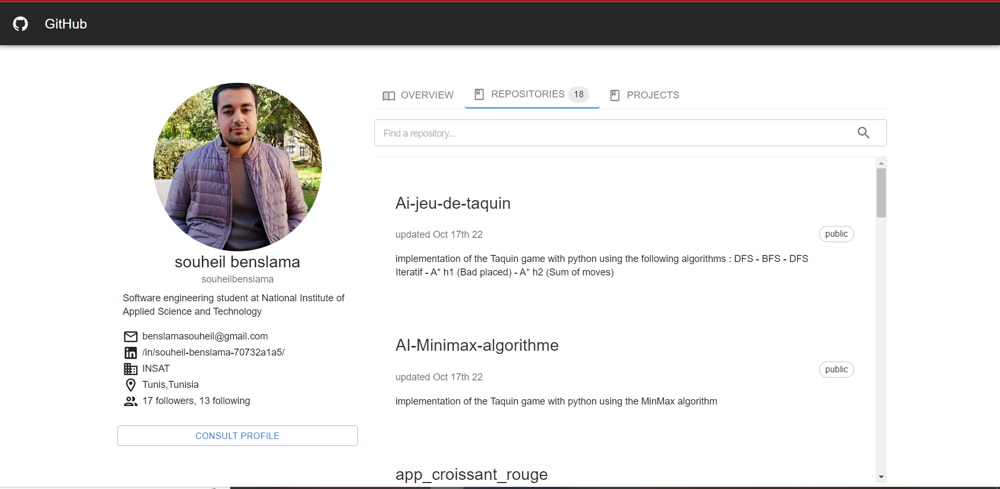

# Github repositories React App

## description 
This project is a github public page clone that shows  a specific account user info with a detailed list of its repositories. This app interface  follows good user experience principle and ises  the official [GitHub API](https://docs.github.com/en/rest) to fetch repositories per user.

you can access the app by click this link [GtihubReopsitories](https://visionary-fox-474731.netlify.app/)

## interface




## on how to run it

In order to run this app you need to start by cloning it in your machine
``` console
$ git clone https://github.com/chaimabg/GitHub-Repositories.git your_new_project
$ cd your_new_project
```
then you need to create a `.env` file with the following values:
```
REACT_APP_GITHUB_TOKEN= github_token
REACT_APP_GITHUB_USERNAME= user_name
```

then runn the app with
```console
$ npm start

```
## how to run the test suite
you can run the test suite with
```console
$ npm test

```
## Future improvements
* add more test suits
* add username input to open a specific user account
* access repositories code

## feedback 
This project was an excellent opportunity to refresh my knowledge of react and to familiarize myself with [materialUI](https://mui.com/) components . 

